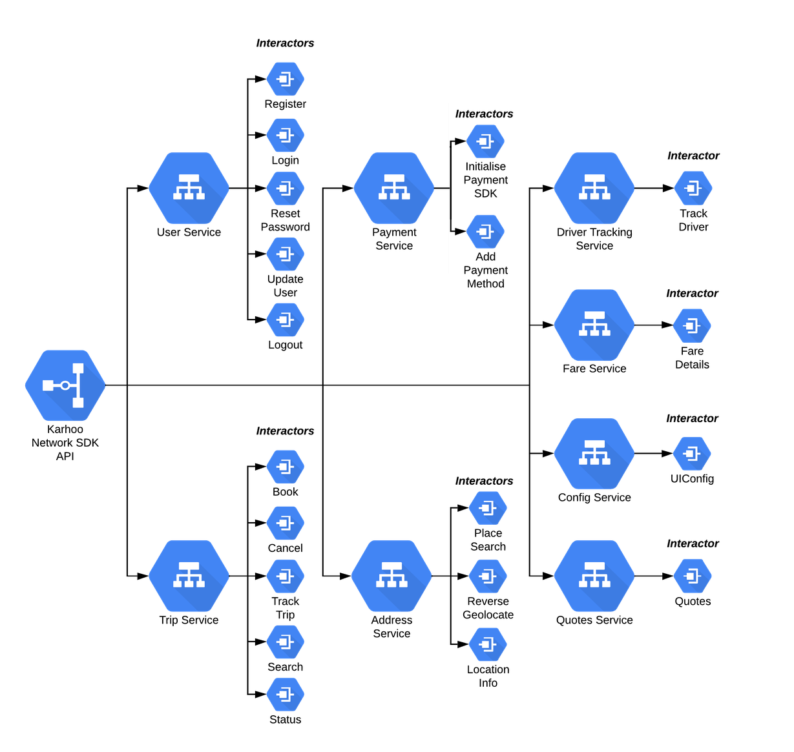

***

<div align="center">
<a href="https://karhoo.com">
  
</a>
</div>

<h1>Karhoo iOS Network SDK</h1>


KarhooSDK is a framework for integrating with the KarhooAPI: https://developer.karhoo.com


[**Read The Docs**](https://developer.karhoo.com/docs/build-apps-using-sdks)


## Installation

#### CocoaPods
You can use [CocoaPods](http://cocoapods.org/) to install `KarhooSDK` by adding it to your `Podfile`:

```ruby

use_frameworks!
pod 'KarhooSDK'
```

then import `KarhooSDK` wherever you want to access Karhoo services

``` swift
import KarhooSDK
```

#### Carthage
Create a `Cartfile` that lists the framework and run `carthage update`. Follow the [instructions](https://github.com/Carthage/Carthage#if-youre-building-for-ios) to add `$(SRCROOT)/Carthage/Build/iOS/YourLibrary.framework` to an iOS project.

```
github "Karhoo/Karhoo-ios-sdk"
```

# SDK Architecture overview:

The SDK is split into Services. Services such as Trip, DriverTracking, Availability, User, Payments etc. These services in turn depend on Interactors, these Interactors depend on a request. Simply calling a function in a service will trigger the interactor to call the request. The request uses our HttpClient to make the network call. 

Call and PollCall objects are returned from the KarhooSDK. PollCalls return observables which can be used to poll the endpoint, and Calls have an execute function which fires the request. 

Models are encoded/decoded using Decodable structs. These are located in Api/DataObjects/Request /Response groups. 

There is a unit test target that tests individual classes work as expected, and there is an integration test target that uses OHHTPStubs to test the sdk works as expected end to end. (from the network layer to a service)



# Setup For Development 
Install Carthage 
	 `brew install carthage`
   
If you are running the project for the first time, navigate to BuiildPhases and under Link Binary with Libraries, remove the existing items 
Close Xcode

Run 
	`carthage update`
  
Open Xcode
If you are running the project for the first time, navigate to BuiildPhases and under Link Binary with Libraries, add the Carthage/Build/iOS/XXX.framework/

## Running Tests
There is an Xcode scheme for unit tests and integration tests. Unit tests test the functionality of individual classes using mocked dependencies. The integration tests mock backend responses with JSON contrtacts and ensure the SDK works from input to output.

## Client example
There is an example project inside the Client directory of this repository. This is meant to be a fast way to test SDK changes and development steps.  You will need to add access Keys to the client module as these are ignored due to this being an open source repository. 

```swift
struct Keys {
  static let identifier = ""
  ...
}
```

## Issues

_Looking to contribute?_

### 🐛 Bugs

Please file an issue for bugs, missing documentation, or unexpected behavior.

### 💡 Feature Requests

Please file an issue to suggest new features. Vote on feature requests by adding
a 👍. This helps maintainers prioritize what to work on.

### ❓ Questions

For questions related to using the library, please re-visit a documentation first. If there are no answer, please create an issue with a label `help needed`.

## Useful Links

[Karhoo Developer Site](https://developer.karhoo.com/)

[The iOS UI SDK](https://github.com/karhoo/karhoo-ios-ui-sdk)

## License
[BSD-2-Clause](./LICENSE)

